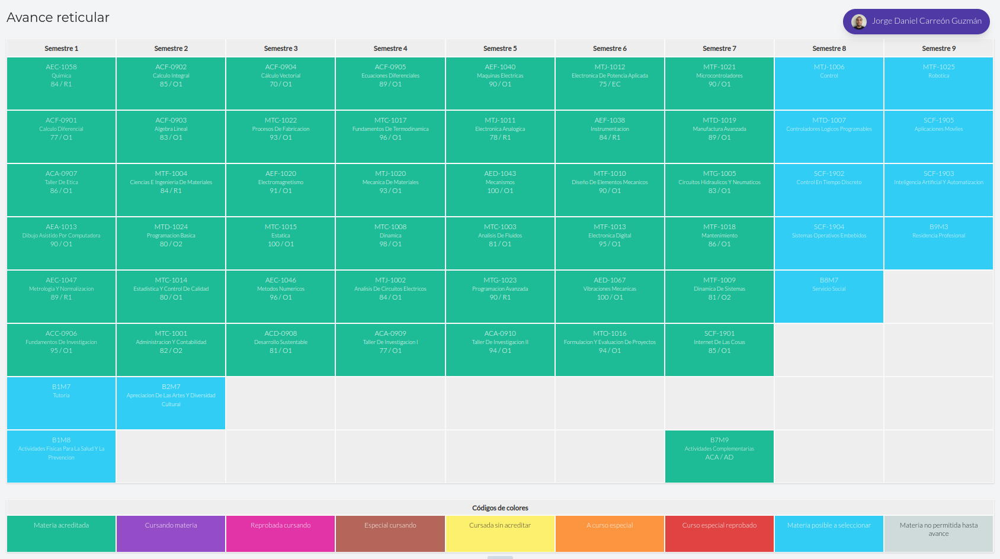

# Sobre este repositorio: 

El principal motivo de haber hecho esto, es para demostrar cierta evidencia de mi experiencia en la universidad. Yo estudié durante más de 4 años Ingeniería Mecatrónica, y aunque es complicado explicar mi relación ella en pocas líneas y el porque termine abandonando la carrera, me pareció importante demostrar lo que hice en mi etapa universitaria. Obviamente no es todo con lo que aprendí y trabajé, pero es algo que demuestra bien lo que hacía.    
Aunque Mecatrónica no está directamente relacionado con Ciencia de datos, las matemáticas base son las mismas, por lo que pude desarrollar cierta intuición con los cálculos y ciertas habilidades ingenieriles a lo largo de estos años.  
Los proyectos trabajados son diferentes, pero no diria que más sencillos. En ciertos aspectos diria que hasta mas complejos, puesto que desarrollas capacidades electrónicas, mecánicas y computacionales que te permiten percibir la importancia de las matemáticas en el campo fisico.  

---

Además de esto, quiero adjuntar mi carga académica, para poder visualizar las materias que llevé en mi etapa universitaria n.n:

---

Y si se preguntan el porque si estaba tan cerca de terminar, porque dejé la escuela, con gusto puedo explicarselos! Actualmente estoy dado de "baja temporal", pero si es que consigo empleo, quizá no vuelva. 

